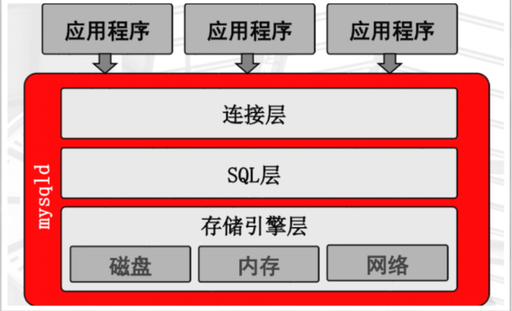
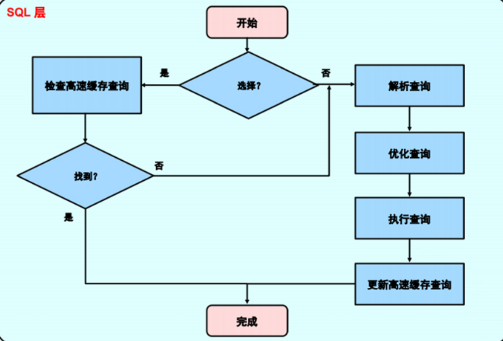
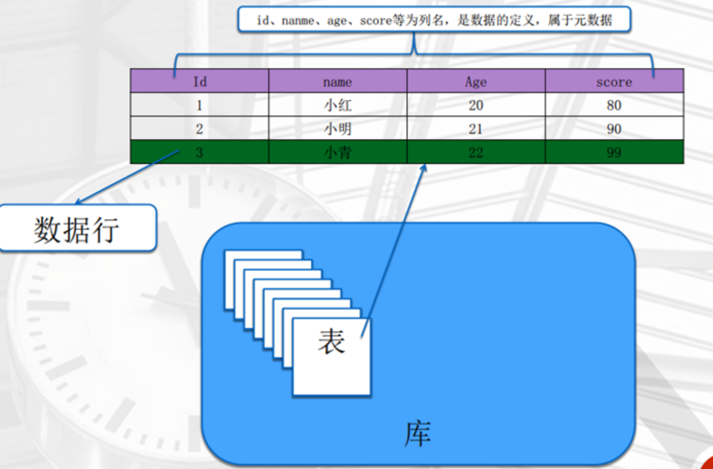
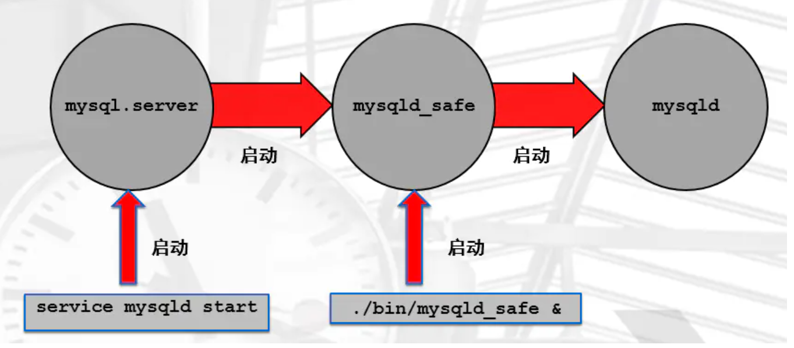
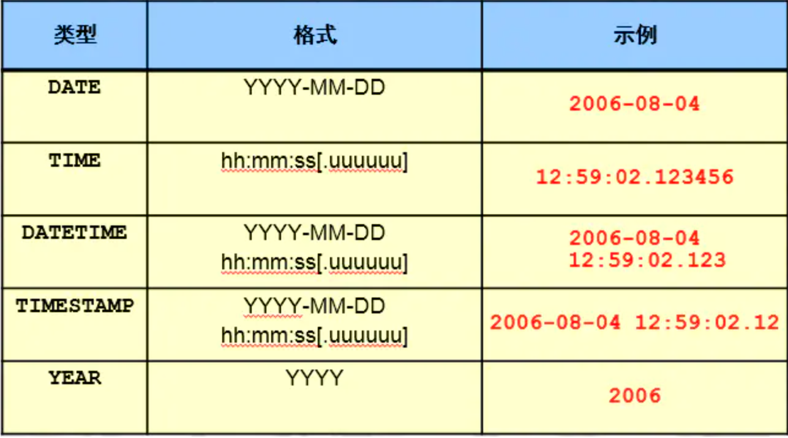
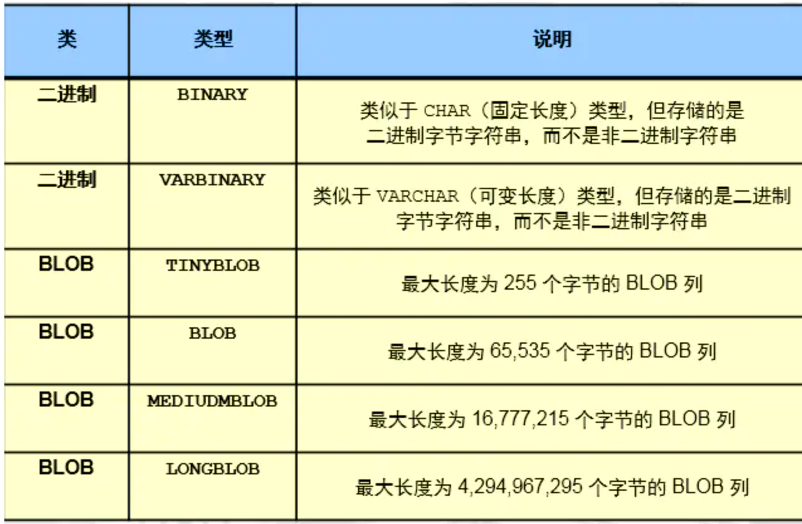
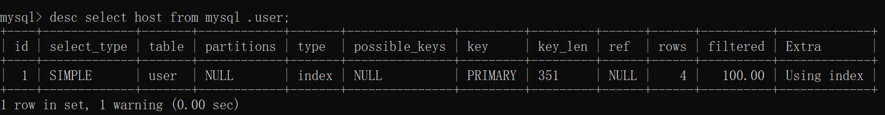
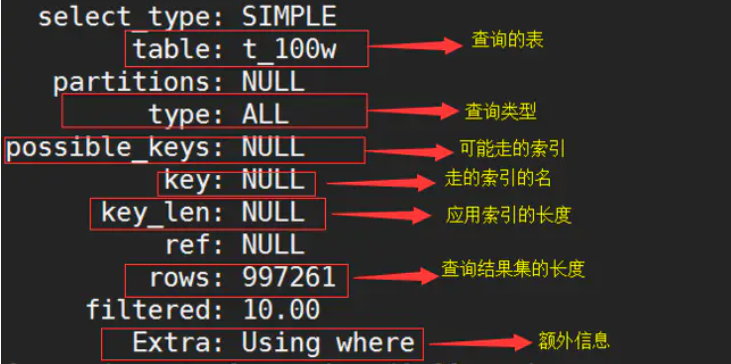

## MySQL 介绍和安装

### 什么是数据库？

数据库（Database）是按照数据结构来组织、存储和管理数据的仓库。

每个数据库都有一个或多个不同的 API 用于创建，访问，管理，搜索和复制所保存的数据。

`RDBMS` 即关系数据库管理系统(Relational Database Management System)的特点：

  	1. 数据以表格的形式出现
  	2. 每行为各种记录名称
  	3. 每列为记录名称所对应的数据域
  	4. 许多的行和列组成一张表单
  	5. 若干的表单组成database


### RDBMS 术语

+ `数据库`: 数据库是一些关联表的集合。

+ `数据表`: 表是数据的矩阵。在一个数据库中的表看起来像一个简单的电子表格。

+ `列`: 一列(数据元素) 包含了相同类型的数据, 例如邮政编码的数据。

+ `行`：一行（=元组，或记录）是一组相关的数据，例如一条用户订阅的数据。

+ `冗余`：存储两倍数据，冗余降低了性能，但提高了数据的安全性。

+ `主键`：主键是唯一的。一个数据表中只能包含一个主键。你可以使用主键来查询数据。

+ `外键`：外键用于关联两个表。

+ `复合键`：复合键（组合键）将多个列作为一个索引键，一般用于复合索引。

+ `索引`：使用索引可快速访问数据库表中的特定信息。索引是对数据库表中一列或多列的值进行排序的一种

+ 结构。类似于书籍的目录。

+ `参照完整性`: 参照的完整性要求关系中不允许引用不存在的实体。与实体完整性是关系模型必须满足的完

  整性约束条件，目的是保证数据的一致性。


### DBMS 数据库管理系统

+ `RDBMS`  ： 关系型数据库管理系统, 比较适合于,安全级别要求高的数据以及关系较复杂的数据
  		Oracle ，MySQL ，PG，MSSQL
+ `NoSQL`  ： 非关系型数据库管理系统, 适合于高性能存取数据,一般是配合RDBMS进行使用的
  		键-值（key-value）:  Redis ，memcached
  		文档（document）：Mongodb
+ `NEWSQL` （分布式）： TiDB，Spanner ，AliSQL(RDS+DRDS) ，OB ，PolarDB


### MySQL 5.7.26 二进制版本安装

1. 下载并上传软

```shell
下载并上传软件至 /server/tools
# mkdir -p /server/tools
# cd /server/tools/
# yum install -y lrzsz
	使用 rz 命令将windows文件上传到linux
	使用 sz 命令将linux文件下载到windows
# ls
mysql-5.7.26-linux-glibc2.12-x86_64.tar.gz
```

2. 验证MySQL安装文件完整性

```shell
# md5sum mysql-5.7.26-linux-glibc2.12-i686.tar 
1442a409d8bbf8f2133a87239527d5f6  mysql-5.7.26-linux-glibc2.12-i686.tar
```

3. 解压软件

```shell
# tar xf mysql-5.7.26-linux-glibc2.12-x86_64.tar.gz 
# mkdir /application
# mv  mysql-5.7.26-linux-glibc2.12-x86_64  /application/mysql
```


4. 用户的创建处理原始环境

```shell
# yum remove mariadb-libs-5.5.56-2.el7.x86_64 -y
# rpm -qa |grep mariadb
# useradd -s /sbin/nologin mysql
```

5. 设置环境变量

```shell
# vim /etc/profile
export PATH=/application/mysql/bin:$PATH
# source /etc/profile
# mysql -V

注意：
linux下执行 mysql -V 命令时提示 cannot execute binary file
碰到这种情况 请检查系统是32位还是64位，安装的软件是32位还是64位
可以通过 
# uname -a 
mysql  Ver 14.14 Distrib 5.7.26, for linux-glibc2.12 (x86_64) using  EditLine wrapper

# getconf LONG_BIT 
会显示是32 或是64
```

6. 创建数据路径

```shell
1. 添加一块新磁盘模拟数据盘
2. 格式化并挂载磁盘
# mkfs.xfs /dev/sdb
# mkdir /data
# blkid
# vim /etc/fstab 
# UUID="fce8b7ef-3d5b-4b5f-b787-d13e61b21885" /data xfs defaults 0 0
# mount -a
# df -h
```

7. 授权

```shell
 chown -R mysql.mysql /application/*
 chown -R mysql.mysql /data
```

8. 初始化数据（创建系统数据）

```shell

# 5.6 版本 初始化命令  /application/mysql/scripts/mysql_install_db 

# 5.7 版本
# mkdir /data/mysql/data -p 
# chown -R mysql.mysql /data
# mysqld --initialize --user=mysql --basedir=/application/mysql --datadir=/data/mysql/data 

说明：
--initialize 参数：
1. 对于密码复杂度进行定制：12位，4种 
2. 密码过期时间：180
3. 给root@localhost用户设置临时密码

报错: 
报错原因: Linux系统中缺少libaio-devel 软件包
mysqld: error while loading shared libraries: libaio.so.1: cannot open shared object file: No such file or directory
解决：
# yum install -y libaio-devel
# mysqld --initialize --user=mysql --basedir=/application/mysql --datadir=/data/mysql/data
2019-06-13T04:21:27.706564Z 1 [Note] A temporary password is generated for root@localhost: =mrV)_16is4U


##########  一般使用--initialize-insecure 初始化 ########

--initialize-insecure 参数：
无限制，无临时密码
[root@ixfosa /data/mysql/data]# \rm -rf /data/mysql/data/*
[root@ixfosa ~]# mysqld --initialize-insecure --user=mysql --basedir=/application/mysql --datadir=/data/mysql/data
```

8. 配置文件的准备

```shell

# cat >/etc/my.cnf <<EOF
[mysqld]
user=mysql
basedir=/application/mysql
datadir=/data/mysql/data
socket=/tmp/mysql.sock
server_id=6
port=3306
[mysql]
socket=/tmp/mysql.sock
EOF
```

9. 启动数据库

```shell

1. sys-v 
[root@ixfosa /etc/init.d]# cp /application/mysql/support-files/mysql.server  /etc/init.d/mysqld 
[root@ixfosa /etc/init.d]# service mysqld restart


2. systemd 
注意： sys-v 方式启动过的话，需要先提前关闭，才能以下方式登录
cat >/etc/systemd/system/mysqld.service <<EOF
[Unit]
Description=MySQL Server
Documentation=man:mysqld(8)
Documentation=http://dev.mysql.com/doc/refman/en/using-systemd.html
After=network.target
After=syslog.target
[Install]
WantedBy=multi-user.target
[Service]
User=mysql
Group=mysql
ExecStart=/application/mysql/bin/mysqld --defaults-file=/etc/my.cnf
LimitNOFILE = 5000
EOF
```


**管理员用户密码忘记解决**

```shell

--skip-grant-tables  #跳过授权表
--skip-networking    #跳过远程登录

SET PASSWORD = PASSWORD('ixfosa');  #修改当前用户的密码


1 关闭数据库
[root@ixfosa ~]# /etc/init.d/mysqld stop

2 启动数据库到维护模式
[root@ixfosa ~]# mysqld_safe --skip-grant-tables --skip-networking &

3 数据库无密码进入
[root@ixfosa ~]# mysql   

4 登录并修改密码
mysql> alter user root@'localhost' identified by 'ixfosa';
ERROR 1290 (HY000): The MySQL server is running with the --skip-grant-tables option so it cannot execute this statement

mysql> flush privileges;  #刷新MySQL的系统权限相关表
mysql> alter user root@'localhost' identified by 'ixfosa';
```

### MySQL目录结构

```sql
1）bin 目录
	用于放置一些可执行文件，如 mysql.exe、mysqld.exe、mysqlshow.exe 等。
2）docs 目录
	存放一些文档
3）Data 目录
	登录数据库后，可使用 SHOW GLOBAL VARIABLES LIKE "%Datadir%"; 命令查看 Data 目录位置。
4）include 目录
	用于放置一些头文件，如：mysql.h、mysql_ername.h 等。
5）lib 目录
	用于放置一系列库文件
6）share 目录
	用于存放字符集、语言等信息
7）my.ini 文件
	my.ini 是 MySQL 默认使用的配置文件，一般情况下，只要修改 my.ini 配置文件中的内容就可以对 MySQL 进行配置。

```

my.ini 是 MySQL 默认使用的配置文件，其它的配置文件都是适合不同数据库的配置文件的模板，在文件名中就说明了适合的数据库类型，下面对这几个配置文件进行详细讲解。

- my-huge.ini：适合超大型数据库的配置文件。
- my-large.ini：适合大型数据库的配置文件。
- my-medium.ini：适合中型数据库的配置文件。
- my-small.ini：适合小型数据库的配置文件。
- my-template.ini：是配置文件的模板，MySQL 配置向导将该配置文件中选择项写入到 my.ini 文件。
- my-innodb-heavy-4G.ini：表示该配置文件只对于 InnoDB 存储引擎有效，而且服务器的内存不能小于 4GB。


## MySQL体系结构与管理

### MySQL C/S结构介绍 


两种连接方式：

```shell
TCP/IP方式（远程、本地）：
mysql -uroot -pixfosa -h 10.0.0.51 -P3306

Socket方式(仅本地)：
mysql -uroot -pixfosa -S /tmp/mysql.sock
```

### MySQL实例的构成




MySQL在启动过程

+ 启动后台守护进程（mysqld），并生成工作线程（xxxx）
+ 预分配内存结构供MySQL处理数据使用
+ 线程是干活的，进程是分配线程的
+ MySQL启动过程中，启动了一个守护进程（mysqld），并生成了许多线程


实例是什么：

+ mysqld +  master thread   + Thread  + 预分配的内存


###  mysqld服务的构成

分为三层：

+ `连接层`
+ `SQL层`
+ `存储引擎层`

####  连接层

**作用：**

1. 提供连接协议 : Socket  ,   TCP/IP

2.  用户验证（root@localhost）密码合法性，进行匹配专门的授权表。

3. 派生一个专用连接线程（接收SQL，返回结果）    mysql> `show processlist;`
   	


#### SQL层

sql层的处理流程: （优化方面至关重要的）




SQL：结构化的查询语言（数据库内部的逻辑语言）又分为：

+ `DQL `   数据查询语言
+ `DDL`   数据定义语言
+ `DML`   数据操作语言
+ `DCL`   数据控制语言

**作用：**

1. 验证SQL语法和SQL_MODE

   + sql_mode,简而言之就是：它定义了你MySQL应该支持的sql语法，对数据的校验等等。

   + 查看当前数据库使用的sql_mode：mysql> ``select` `@@sql_mode;
2. 验证语义
3. 验证权限
4. 解析器进行语句解析，生成执行计划（解析树）
5. 优化器（各种算法，基于执行代价），根据算法，找到代价最低的执行计划。
   				代价：CPU  IO  MEM
6. 执行器按照优化器选择执行计划，执行SQL语句，得出获取数据的方法。
7. 提供query cache(默认不开)，一般不开，会用redis
8. 记录操作日志（binlog），默认没开


#### 存储引擎层

存储引擎是充当不同表类型的处理程序的服务器组件,  真正和磁盘打交道的一个层次
根据SQL层提供的取数据的方法，拿到数据，返回给SQL，结构化成表，再又连接层线程返回给用户。

**作用：**

+ 存数据、取数据
+ 数据存储方式
+ 事务（增、删、改）
+ 备份恢复    
+ 高级功能（高可用的架构、读写分离架构）


**依赖于存储引擎的功能**

+ 存储介质
+ 事务功能
+ 锁定
+ 备份和恢复
+ 优化
+ 特殊功能：
  + 全文搜索
  + 引用完整性
  + 空间数据处理


### MySQL逻辑存储结构




 `库 ` ----> Linux目录

+ 库名
+ 库属性

```mysql
create database wordpress charset utf8mb4;    ----> mkdir /wordpress
show databases;							      ----> ls /
use wordpress;								  ----> cd /wordpress
```

`表 ` ----> Linux的文件

+ 列（字段） 		
+ 列属性	
+ 数据行（记录）			----> Linux数据行
+ 表属性（元数据）		----> Linux 文件属性


### MySQL物理存储结构

库： 使用 `FS上的目录` 来表示 
表： 

+ MyISAM(ext2)
  + user.frm  ： 存储的表结构（列，列属性）
  + user.MYD  :  存储的数据记录
  + user.MYI  ： 存储索引

+ InnoDB(XFS)
  + time_zone.frm ： 存储的表结构（ 列，列属性）
  + time_zone.ibd ： 存储的数据记录和索引
  + ibdata1            :   数据字典信息

```shell
表的物理存储结构:

MyISAM（一种引擎）的表：
-rw-r----- 1 mysql mysql   10816 Apr 18 11:37 user.frm
-rw-r----- 1 mysql mysql     396 Apr 18 12:20 user.MYD
-rw-r----- 1 mysql mysql    4096 Apr 18 14:48 user.MYI

InnoDB(默认的存储引擎)的表：
-rw-r----- 1 mysql mysql    8636 Apr 18 11:37 time_zone.frm
-rw-r----- 1 mysql mysql   98304 Apr 18 11:37 time_zone.ibd
time_zone.frm：存储列相关信息
time_zone.ibd：数据行+索引
```

```shell
表的段、区、页（16k）:

页：最小的存储单元，默认16k
区：64个连续的页，共1M
段：一个表就是一个段，包含一个或多个区
```


## MySQL管理

### 用户管理

#### 作用 

+ 登录MySQL 
+ 管理MySQL 


#### 用户的定义

`用户名@'白名单'`

```mysql
username@'%'
username@'localhost'
username@'127.0.0.1'
username@'10.0.0.%'
username@'10.0.0.5%'
username@'10.0.0.0/255.255.254.0'
username@'10.0.%'
```


#### 用户的操作 

##### 建用户

```shell
mysql> create user ixfosa@'10.0.0.%' identified by '123';
```

说明：
8.0以前，可以自动创建用户并授权

```shell
mysql> grant all on *.* to ixfosa@'10.0.0.%' identified by '123';
```


##### 查询用户

```mysql
mysql> select user,host from mysql.user;
```

##### 删除用户

```mysql
mysql> drop user ixfosa@'10.0.0.%' ;
```

##### 修改用户密码

```mysql
mysql> alter user ixfosa@'10.0.0.%' identified by '123456';
```


### 权限管理

#### 权限列表

```mysql
ALL:
SELECT,INSERT, UPDATE, DELETE, CREATE, DROP, RELOAD, SHUTDOWN, PROCESS, FILE, REFERENCES, INDEX, ALTER, SHOW DATABASES, SUPER, CREATE TEMPORARY TABLES, LOCK TABLES, EXECUTE, REPLICATION SLAVE, REPLICATION CLIENT, CREATE VIEW, SHOW VIEW, CREATE ROUTINE, ALTER ROUTINE, CREATE USER, EVENT, TRIGGER, CREATE TABLESPACE

ALL : 以上所有权限，一般是普通管理员拥有的
with grant option：超级管理员才具备的，给别的用户授权的功能
```

#### 授权命令-grant

```mysql
grant all on *.* to ixfosa@'10.0.0.%' identified by '123' with grant option;

grant SELECT, CREATE on dataBaseName.* to long@'10.0.0.%' identified by '123' with grant option;

grant 权限  on 作用目标  to 用户 identified by 密码 with grant option;

作用目标:
	*.*
	dataBaseName.* 
	dataBaseName.table
```

#### 授权案例

1. 创建一个管理员用户root，可以通过10网段，管理数据库.

  ```mysql
  grant all on *.* to root@'10.0.0.%' identified by '123' with grant option;
  FLUSH  PRIVILEGES;
  ```

2. 创建一个应用用户wordpress，可以通过10网段，wordpress库下的所有表进行SELECT,INSERT, UPDATE, DELETE.

  ```mysql
  grant SELECT,INSERT, UPDATE, DELETE on wordpress.* to wordpress@'10.0.0.%' identified by '123' with grant option;
  FLUSH  PRIVILEGES;
  ```

#### 回收权限-revoke

```mysql
mysql> show grants for wordpress@'10.0.0.%';
mysql> revoke delete on wordpress.*  from 'wordpress'@'10.0.0.%';
mysql> show  grants for wordpress@'10.0.0.%';

mysql> revoke 权限 on 作用目标  from 用户;
```

#### 查看权限-show

```mysql
查看当前用户（自己）权限：
	show grants;
	
查看其他 MySQL 用户权限：
	show grants for dba@localhost;
	show grants for 用户;
```

 **注意:授权后必须`FLUSH PRIVILEGES`;否则无法立即生效。**


### 启动关闭




日常启用

```mysql
mysql.server start ---> mysqld_safe ---> mysqld 
mysql.service      ---> mysqld 
需要依赖于 /etc/my.cnf

DOS 命令启动 MySQL 服务
net start mysql 启动 MySQL 服务，
net stop mysql  停止 MySQL 服务
```

维护性的任务

```mysql
mysqld_safe --skip-grant-tables --skip-networking &
我们一般会将我们需要的参数临时加到命令行.
也会读取 /etc/my.cnf 的内容,但是如果冲突,命令行优先级最高
```

关闭

```mysql
# mysqld_safe &       --启动mysql服务
# mysqladmin -uroot -p123 shutdown   --关闭  
```

> 提示：
> 以上多种方式，都可以单独启动MySQL服务
> `mysqld_safe`和`mysqld`一般是在临时维护时使用。
> 另外，从Centos 7系统开始，支持systemd直接调用mysqld的方式进行启动数据库


### 初始化配置-my.ini

作用

```
(1)影响数据库的启动
(2)影响到客户端的功能
```

初始化配置的方法

```
(1)初始化配置文件(例如/etc/my.cnf) (所有启动方式)
(2)启动命令行上进行设置(例如:mysqld_safe  mysqld)
(3)预编译时设置(仅限于编译安装时设置)
```

初始化配置文件的书写格式

```
[标签]
配置项=xxx

[标签]
配置项=xxx
```

配置文件标签的归类

```
标签类型：服务端、客户端

服务器端:
[mysqld]
[mysqld_safe]
[server]

客户端: 
[mysql]
[mysqladmin]
[mysqldump]
[client]
```

配置文件设置样板(5.7)

```mysql
[mysqld]    #服务器端配置
user=mysql  #用户               
basedir=/application/mysql   #软件安装目录 
datadir=/data/mysql/data    #数据路径
socket=/tmp/mysql.sock  #socket文件位置
server_id=6 #服务器id号
port=3306   # 端口号

[mysql] #客户端配置
socket=/tmp/mysql.sock   #socket文件位置
```

配置文件读取顺序

```shell
# mysqld --help --verbose | grep my.cnf
/etc/my.cnf /etc/mysql/my.cnf /usr/local/mysql/etc/my.cnf ~/.my.cnf 

默认情况下，MySQL启动时，会依次读取以上配置文件，如果有重复选项，会以最后一个文件设置的为准。
但是，如果启动时加入了--defaults-file=xxxx时，以上的所有文件都不会读取.
```

强制使用自定义配置文件

```shell
--defautls-file 
# mysqld_safe --defaults-file=/tmp/aa.txt &
```


### 连接管理

注意:提前应该将用户授权做好

```shell
mysql> grant all on *.* to root@'10.0.0.%' identified by '123';
TCP/IP :
	mysql -uroot -p -h 10.0.0.51 -P3306 

Socket :
	mysql -uroot -p -S /tmp/mysql.sock
```

```shell
-u                   用户
-p                   密码
-h                   IP
-P                   端口
-S                   socket文件
-e                   免交互执行命令
<                    导入SQL脚本

[root@ixfosa ~]# mysql -uroot -p -h 10.0.0.51 -P3306
Enter password:

mysql> select @@socket;
+-----------------+
| @@socket        |
+-----------------+
| /tmp/mysql.sock |

[root@ixfosa ~]# mysql -uroot -p -S /tmp/mysql.sock
Enter password:
[root@ixfosa ~]# mysql -uroot -p -e "select user,host from mysql.user;"
Enter password:
+---------------+-----------+
| user          | host      |
+---------------+-----------+
| abc          | 10.0.0.%  |
| app          | 10.0.0.%  |
| root          | 10.0.0.%  |
| mysql.session | localhost |
| mysql.sys    | localhost |
| root          | localhost |
+---------------+-----------+

[root@ixfosa ~]# mysql -uroot -p < world.sql
Enter password:
```

### 内置命令

````shell
help 					打印mysql帮助
\c  ctrl+c 				结束上个命令运行
\q quit; exit; ctrl+d 	退出mysql
\G 						将数据竖起来显示
source 					恢复备份文件	
````

### 多实例管理

1. 准备多个目录

```shell
# mkdir -p /data/330{7,8,9}/data   
```

2.  准备配置文件

```shell
cat > /data/3307/my.cnf <<EOF
[mysqld]
basedir=/application/mysql     #软件安装目录 
datadir=/data/3307/data          #数据路径
socket=/data/3307/mysql.sock      #socket文件位置
log_error=/data/3307/mysql.log    #错误日志
port=3307       # 端口号
server_id=7     #服务器id号
log_bin=/data/3307/mysql-bin       #开启 Binlog 并写明存放日志的位置
EOF

cat > /data/3308/my.cnf <<EOF
[mysqld]
basedir=/application/mysql
datadir=/data/3308/data
socket=/data/3308/mysql.sock
log_error=/data/3308/mysql.log
port=3308
server_id=8
log_bin=/data/3308/mysql-bin
EOF

cat > /data/3309/my.cnf <<EOF
[mysqld]
basedir=/application/mysql
datadir=/data/3309/data
socket=/data/3309/mysql.sock
log_error=/data/3309/mysql.log
port=3309
server_id=9
log_bin=/data/3309/mysql-bin
EOF
```

3. 初始化三套数据

```shell
mv /etc/my.cnf /etc/my.cnf.bak
mysqld --initialize-insecure  --user=mysql --datadir=/data/3307/data --basedir=/application/mysql

mysqld --initialize-insecure  --user=mysql --datadir=/data/3308/data --basedir=/application/mysql

mysqld --initialize-insecure  --user=mysql --datadir=/data/3309/data --basedir=/application/mysql
```

4. systemd管理多实例

```shell
cd /etc/systemd/system

cp mysqld.service mysqld3307.service
cp mysqld.service mysqld3308.service
cp mysqld.service mysqld3309.service

###################################################

vim mysqld3307.service
# 修改为:
ExecStart=/application/mysql/bin/mysqld  --defaults-file=/data/3307/my.cnf

vim mysqld3308.service
# 修改为:
ExecStart=/application/mysql/bin/mysqld  --defaults-file=/data/3308/my.cnf

vim mysqld3309.service
# 修改为:
ExecStart=/application/mysql/bin/mysqld  --defaults-file=/data/3309/my.cnf

###################################################

[root@ixfosa system]# grep "ExecStart" mysqld3309.service
ExecStart=/application/mysql/bin/mysqld --defaults-file=/data/3309/my.cnf

[root@ixfosa system]# grep "ExecStart" mysqld3308.service
ExecStart=/application/mysql/bin/mysqld --defaults-file=/data/3308/my.cnf

[root@ixfosa system]# grep "ExecStart" mysqld3307.service
ExecStart=/application/mysql/bin/mysqld --defaults-file=/data/3307/my.cnf
```

5.  授权

```shell
chown -R mysql.mysql /data/*
```

6. 启动

```shell
systemctl start mysqld3307.service
systemctl start mysqld3308.service
systemctl start mysqld3309.service
```

7. 验证多实例

```shell
netstat -lnp|grep 330
mysql -S /data/3307/mysql.sock -e "select @@server_id"
mysql -S /data/3308/mysql.sock -e "select @@server_id"
mysql -S /data/3309/mysql.sock -e "select @@server_id"
```


## SQL介绍

### SQL引入

SQL

+ 结构化的查询语言
+ 关系型数据库通用的命令
+ 遵循SQL92的标准(SQL_MODE)


SQL常用种类

+ `DDL`  数据定义语言, 	用来创建或删除数据库以及表等对象，主要包含以下几种命令
  + `DROP`：删除数据库和表等对象
  + `CREATE`：创建数据库和表等对象
  + `ALTER`：修改数据库和表等对象的结构

+ `DCL`  数据控制语言, 用来确认或者取消对数据库中的数据进行的变更。还可以对数据库中的用户设定权限。
  + `GRANT`：赋予用户操作权限
  + `REVOKE`：取消用户的操作权限
  + `COMMIT`：确认对数据库中的数据进行的变更
  + `ROLLBACK`：取消对数据库中的数据进行的变更

+ `DML`  数据操作语言 , 用来变更表中的记录
  + `SELECT`：查询表中的数据
  + `INSERT`：向表中插入新数据
  + `UPDATE`：更新表中的数据
  + `DELETE`：删除表中的数据

+ `DQL`  数据查询语言, 用来查询表中的记录
  + `SELECT` 命令，来查询表中的数据。


字符集:  `charset`

```sql
show charset;

--utf8		   : 3个字节
--utf8mb4 (建议): 4个字节,支持emoji
```

排序规则(校对规则): `collation` 

```sql
mysql> show collation;

--utf8mb4_general_ci 			大小写不敏感
--utf8mb4_bin  				    大小写敏感(存拼音,日文)
```

### SQL的基本书写规则

1. SQL 语句要以分号 ; 结尾

```
在 RDBMS （关系型数据库）当中，SQL 语句是逐条执行的，一条 SQL 语句代表着数据库的一个操作。
```

2. SQL 语句不区分大小写

```
SQL 不区分关键字的大小写。例如，不管写成 SELECT 还是 select，解释都是一样的。表名和列名也是如此。
```

>  提示：关键字是数据库事先定义的，有特别意义的单词。

> 需要 注意的是，插入到表中的数据是区分大小写的。例如，向数据库中插入单词 Computer、COMPUTER 或 computer，这三个是不一样的数据

3. 常数的书写方式是固定的

```
SQL 语句常常需要直接书写字符串、日期或者数字。例如，书写向表中插入字符串、日期或者数字等数据的 SQL 语句。
```

在 SQL 语句中直接书写的字符串、日期或者数字等称为常数。常数的书写方式如下所示：

- SQL 语句中含有字符串的时候，需要像 'abc' 这样，使用英文单引号`'`将字符串括起来，用来标识这是一个字符串。
- SQL 语句中含有日期的时候，同样需要使用英文单引号将其括起来。日期的格式有很多种（'26 Jan 2010' 或者'10/01/26'   2020-01-26等）
- 在 SQL 语句中书写数字的时候，不需要使用任何符号标识，直接写成 1000 这样的数字即可。

> 注意：列名不是字符串，不能使用单引号。在[MySQL](http://c.biancheng.net/mysql/) 中可以用倒引号``把表名和列名括起来。

单词需要用半角空格或者换行来分隔

```
SQL 语句的单词之间必须使用半角空格（英文空格）或换行符来进行分隔。没有分隔的语句会发生错误，无法正常执行。
```

下面是分隔和未分隔的 SQL 语句：

- CREATE TABLE Product（正确）
- CREATETABLE Product（错误）
- CREATE TABLEProduct（错误)

> 不能 使用全角空格（中文空格）作为单词的分隔符，否则会发生错误，出现无法预期的结果。
>
> SQL 语句中的标点符号必须都是英文状态下的，即半角字。

### 数据类型介绍 

作用:  保证数据的准确性和标准性。

#### 数值类型


```sql
tinyint  ： -128~127
int       ：-2^31~2^31-1
说明：手机号是无法存储到int的。一般是使用char类型来存储收集号
```


#### 字符类型 	


```sql
char(11) ：
定长 的字符串类型,在存储字符串时，最大字符长度11个，立即分配11个字符长度的存储空间，如果存不满，空格填充。
varchar(11):
变长的字符串类型看，最大字符长度11个。在存储字符串时，自动判断字符长度，按需分配存储空间。

如何选择这两个数据类型?
1. 少于255个字符串长度,定长的列值,选择char
2. 多于255字符长度,变长的字符串,可以选择varchar


enum('bj','tj','sh')：
枚举类型，比较适合于将来此列的值是固定范围内的特点，可以使用enum,可以很大程度的优化我们的索引结构。
```


#### 时间类型



```sql
DATETIME 
范围为从 1000-01-01 00:00:00.000000 至 9999-12-31 23:59:59.999999。
TIMESTAMP 
1970-01-01 00:00:00.000000 至 2038-01-19 03:14:07.999999。
timestamp会受到时区的影响
```


#### 二进制类型




## DDL-定义

### 库的定义

#### CREATE

```sql
--- 创建数据库
--- CREATE DATABASE 库名 [CHARSET 字符集 COLLATE  校对规则];
CREATE DATABASE ixfosa CHARSET utf8mb4 COLLATE  utf8mb4_bin;
```

#### SHOW

```sql
--- 查看库情况
---查看所有数据库
SHOW DATABASES;      

--- SHOW CREATE DATABASE 库名;  ---查看某个数据库
SHOW CREATE DATABASE ixfosa;
```

#### DROP

```sql
--- 删除数据库
DROP DATABASE 库名;
DROP DATABASE ixfosa;
```


#### CREATE

```sql
--- 修改数据库字符集
--- 目标字符集一定是源字符集的严格超级.
--- ALTER DATABASE 库名 CHARSET 字符集;
CREATE DATABASE ixfosa;  --默认latinl 
SHOW CREATE DATABASE ixfosa;
ALTER DATABASE ixfosa CHARSET utf8mb4;

--- 修改数据库校对规则
--- ALTER DATABASE 库名 COLLATE 校对规则;
CREATE DATABASE ixfosa; 
SHOW CREATE DATABASE ixfosa;
ALTER DATABASE ixfosa COLLATE utf8mb4_bin;
```

#### 库定义规范

```
--- 1.库名使用小写字符
--- 2.库名不能以数字开头
--- 3.不能是数据库内部的关键字
--- 4.必须设置字符集.
```

建库标准语句

```sql
mysql> create database db charset utf8mb4;
mysql> show create database db;
```


### 表定义

#### 表, 列属性

```sql
--- 表属性
字符集，排序规则，存储引擎（InnoDB默认的）

--- 列属性
PRIMARY KEY    : 主键约束,表中只能有一个,非空且唯一.但是可以有多个列一起构成。
NOT NULL       : 非空约束,不允许空值,尽可能将所有的列设置为非空。可以设置默认值为0
unsigned       ：无符号,针对数字列，非负数。
UNIQUE KEY     : 唯一键约束,列值不能重复
DEFAULT        : 一般配合 NOT NULL 一起使用.列中，没有录入值时，会自动使用default的值填充
UNSIGNED       : 无符号,一般是配合数字列,非负数
AUTO_INCREMENT : 自增长,针对数字列，顺序的自动填充数据（默认是从1开始，将来可以设定起始点和偏移量）
COMMENT        : 注释

key            :索引, 可以在某列上建立索引，来优化查询,一般是根据需要后添加
```

#### CREATE

```sql
--- 建表        
--- 表名,列名,列属性,表属性
CREATE TABLE stu (
id INT PRIMARY KEY NOT NULL AUTO_INCREMENT COMMENT '学号',
sname VARCHAR(255) NOT NULL  COMMENT '姓名',
age TINYINT UNSIGNED NOT NULL DEFAULT 0 COMMENT '年龄',
gender ENUM('m','f','n') NOT NULL DEFAULT 'n' COMMENT '性别',
intime DATETIME NOT NULL DEFAULT NOW() COMMENT '入学时间'
)ENGINE INNODB CHARSET utf8mb4;

CREATE TABLE 表名 (
	列名 列属性（约束）...,
    ......
    列名 列属性（约束）...
)ENGINE 存储引擎 CHARSET 字符集;

--- 创建一个表结构一样的表
CREATE TABLE test LIKE stu;
```

#### SHOW

```sql
--- 查询建表信息
--- 查看当前数据库下的所有表， 只返回表的名字
SHOW TABLES; 

--- SHOW CREATE TABLE 表名;
SHOW CREATE TABLE stu;

--- 是指定某一个表的所有字段的说明
--- DESC 表名；
DESC stu;
```


#### DROP

```sql
--- 删表
--- DROP TABLE 表名;
DROP TABLE test;
```

#### ALTER

- 添加列

```sql
 ALTER TABLE 表名 ADD 新增列 数据类型 列属性（约束）...;
```

- 删除列

```
 ALTER TABLE 表名 DROP 列名
```

- 修改列

```sql
 ALTER TABLE 表名 MODIFY 列名 数据类型 列属性（约束）...;
```

- 更改列名称

```sql
ALTER TABLE 表名  CHANGE 原列名 新列名 数据类型 列属性（约束）...;
```


```sql
--- 修改
--- 添加列
--- ALTER TABLE 表名 ADD 新增列 数据类型 列属性（约束）...;
--- 在stu表中添加qq列
ALTER TABLE stu ADD qq VARCHAR(20) NOT NULL COMMENT 'qq号';
--- 在sname后加微信列
ALTER TABLE stu ADD wechat VARCHAR(64) NOT NULL UNIQUE COMMENT '微信号' AFTER sname;
--- 在id列前加一个新列num
ALTER TABLE stu ADD num INT NOT NULL UNIQUE COMMENT '身份证' FIRST ;

--- 删除列
--- ALTER TABLE 表名 DROP 列名;
ALTER TABLE stu DROP wechat;

--- 修改列 数据类型的属性
--- ALTER TABLE 表名 MODIFY 列名 数据类型 列属性（约束）...;
ALTER TABLE stu MODIFY sname VARCHAR(64) NOT NULL COMMENT '姓名';

--- 更改列名称
--- ALTER TABLE 表名  CHANGE 原列名 新列名 数据类型 列属性（约束）...;
--- 将 gender 改为 sex，数据类型改为 CHAR 类型 若没有约束，原列约束会消失
ALTER TABLE stu  CHANGE gender sex CHAR(4) NOT NULL COMMENT '性别';
```


#### 建表规范

```sql
--- 1. 表名小写字母,不能数字开头,
--- 2. 不能是保留字符,使用和业务有关的表名
--- 3. 选择合适的数据类型及长度
--- 4. 每个列设置 NOT NULL + DEFAULT .对于数据0填充,对于字符使用有效字符串填充
--- 5. 没个列设置注释
--- 6. 表必须设置存储引擎和字符集
--- 7. 主键列尽量是无关列数字列,最好是自增长
--- 8. enum类型不要保存数字,只能是字符串类型
```


## DCL-控制

作用： 权限控制

#### grant-授权命令

```sql
grant 权限  on 作用目标  to 用户 identified by 密码 with grant option;
```

#### revoke-回收权限

```sql
mysql> revoke 权限 on 作用目标  from 用户;
```


## DML-操作

作用： 对表中的数据行进行增、删、改

```sql
CREATE TABLE stu (
    id INT PRIMARY KEY NOT NULL AUTO_INCREMENT COMMENT '学号',
    sname VARCHAR(255) NOT NULL  COMMENT '姓名',
    age TINYINT UNSIGNED NOT NULL DEFAULT 0 COMMENT '年龄',
    gender ENUM('m','f','n') NOT NULL DEFAULT 'n' COMMENT '性别',
    intime DATETIME NOT NULL DEFAULT NOW() COMMENT '入学时间'
)ENGINE INNODB CHARSET utf8mb4;
```

#### insert 

```sql
--- 最偷懒
--- INSERT 表名 VALUES(value1, value12, ...);
INSERT stu VALUES(1,'zs',18,'m',NOW());
SELECT * FROM stu;

--- 最规范
--- INSERT INTO 表名(列名1, 列名2, ...) VALUES (value1, value12, ...);
INSERT INTO stu(id,sname,age,sex,intime)
VALUES (2,'ls',19,'f',NOW());

--- 针对性的录入数据
INSERT INTO stu(sname,age,sex)
VALUES ('w5',11,'m');

--- 一次性录入多行
INSERT INTO stu(sname,age,sex)
VALUES 
('aa',11,'m'),
('bb',12,'f'),
('cc',13,'m');
```

#### update

```sql
-- update(一定要加where条件)
UPDATE stu SET sname='aaa';
SELECT * FROM stu;

-- UPDATE 表名 SET 列名=value, ... WHERE 条件;
UPDATE stu SET sname='bb' WHERE id=6;
```

#### delete 

```sql
-- delete (一定要有where条件)
DELETE FROM stu;

-- DELETE FROM 表名 WHERE 条件;
DELETE FROM stu WHERE id=9;

-- 生产中屏蔽delete功能
-- 使用update替代delete 
ALTER TABLE stu ADD is_del TINYINT DEFAULT 0 ;
UPDATE stu SET is_del=1 WHERE id=7;
SELECT * FROM stu WHERE is_del=0;
```

## DQL-查询

### Sql执行顺序

1. FROM 子句 组装来自不同数据源的数据
2. WHERE 子句 基于指定的条件对记录进行筛选
3. GROUP BY 子句 将数据划分为多个分组
4. 使用聚合函数进行计算
5. 使用HAVING子句筛选分组
6. 计算所有的表达式
7. 使用ORDER BY对结果集进行排序
8. select 获取相应列
9. limit截取结果集

```sql
-- 通用语法(单表) *****
select 
select  列   
from  表   
where 条件  
group by  条件 
having   条件 
order by 条件
limit
```

### select单独使用

```sql
-- select @@xxx 查看系统参数
SELECT @@port;
SELECT @@basedir;
SELECT @@datadir;
SELECT @@socket;
SELECT @@server_id;
```

### select 函数()

```sql
-- select 函数();
SELECT NOW();
SELECT DATABASE();
SELECT USER();
SELECT CONCAT("hello world");
SELECT CONCAT(USER,"@",HOST) FROM mysql.user;
SELECT GROUP_CONCAT(USER,"@",HOST) FROM mysql.user;
https://dev.mysql.com/doc/refman/5.7/en/func-op-summary-ref.html?tdsourcetag=s_pcqq_aiomsg
```

### select 查询数据

- 查询所有列

```sql
ELECT * FROM 库名;
```

- 查询指定列

```sql
SELECT 列, ... FROM 库名;
```

- 查询时指定别名（as）

```sql
SELECT 列 AS 别名, ... FROM 库名;
```

- 查询时添加常量列

```sql
SELECT 列, ... , value AS 常量列  FROM 库名;
```

- 查询时合并列

```sql
-- 注意：合并列只能合并数值类型的字段
SELECT 列,(列1+列2), ... FROM 库名;
```

查询时去除重复记录--DISTINCT

```sql
SELECT DISTINCT 列 FROM 库名;
-- 另一种语法
SELECT DISTINCT(列) FROM 库名;
```

- 例子

```sql
CREATE TABLE student(
	id INT,
	NAME VARCHAR(20),
	gender VARCHAR(2),
    address VARCHAR(10),
	age INT
)

-- 查询所有列
SELECT * FROM student;

-- 查询指定列
SELECT id,NAME,gender FROM student;

-- 查询时指定别名（as）
-- 注意： 在多表查询是经常使用表的别名
SELECT id AS '编号',NAME AS '姓名' FROM student;

-- 查询时添加常量列
-- 需求： 在查询student表时添加一个班级列，内容为“java就业班”
SELECT id,NAME,gender,age,'java就业班' AS '年级'  FROM student;

-- 查询时合并列
-- 需求： 查询每个学生的servlet和jsp的总成绩
SELECT id,NAME,(servlet+jsp) AS '总成绩' FROM student;
-- 注意：合并列只能合并数值类型的字段
SELECT id,(NAME+servlet) FROM student;

-- 查询时去除重复记录(DISTINCT)
-- 需求： 查询学生的性别     男 女
SELECT DISTINCT gender FROM student;
-- 另一种语法
SELECT DISTINCT(gender) FROM student;
-- 需求: 查询学生所在的地区
SELECT DISTINCT address FROM student;
```


### where 条件查询

- 逻辑条件： `and`(与)     `or`(或)OR

```sql
SELECT * FROM 库名 WHERE 条件 AND/OR 条件; 

SELECT 列, ... FROM 库名 WHERE 条件 AND 条件; -- 交集; 

SELECT 列, ... FROM 库名 WHERE 条件 OR 条件; -- 并集
```

- where配合`in`语句

```sql
SELECT * FROM 表 WHERE 列 IN (value1 ,value2, ...);  -- 并集
```

- 比较条件： >   <   >=  <=  =  <>(不等于)     between and (等价于>= 且 <=)

```sql
SELECT * FROM student WHERE 列>value;

SELECT * FROM student WHERE 列 >= value= AND 列 <= value;

-- 另一个语法sql
SELECT * FROM student WHERE 列 BETWEEN value1 AND value2; -- (包前包后)

SELECT * FROM student WHERE 列<>value;
```

- 空条件(null 空字符串)：  `is null` / `is not null` / =''  / <>''

​		null vs  空字符串
​		-- `null`：表示没有值
​		-- `空字符串`：有值的！

```sql
-- 判断null
SELECT * FROM 表 WHERE 列 IS NULL ;

-- 判断空字符串
SELECT * FROM 表 WHERE 列='';
```

- 模糊条件： like

​		`%` : 表示任意个字符

​		`_` : 表示一个字符

```sql

SELECT * FROM 表 WHERE 列 LIKE 'value%';value

SELECT * FROM 表 WHERE 列 LIKE 'value_';
```

- 例子

```sql
CREATE TABLE student(
	id INT,
	NAME VARCHAR(20),
	gender VARCHAR(2),
    address VARCHAR(10),
	age INT
)

-- 逻辑条件： and(与)     or(或)
-- 需求： 查询id为2，且姓名为李四的学生
SELECT * FROM student WHERE id=2 AND NAME='李四'; -- 交集

-- 需求： 查询id为2，或姓名为张三的学生
SELECT * FROM student WHERE id=2 OR NAME='张三'; -- 并集

-- 比较条件： >   <   >=  <=  =  <>(不等于)     between and (等价于>= 且 <=)
-- 需求： 查询servlet成绩大于70分的学生
SELECT * FROM student WHERE servlet>70;

-- 需求： 查询jsp成绩大于等于75，且小于等于90分的学生
SELECT * FROM student WHERE jsp>=75 AND jsp<=90;
-- 另一个语法
SELECT * FROM student WHERE jsp BETWEEN 75 AND 90; -- (包前包后)

SELECT * FROM student WHERE gender<>'男';


-- 空条件(null 空字符串)：  is null / is not null / =''  / <>''
-- 需求： 查询地址为空的学生（包括null和空字符串）
-- null vs  空字符串
-- null：表示没有值
-- 空字符串：有值的！
-- 判断null
SELECT * FROM student WHERE address IS NULL ;
-- 判断空字符串
SELECT * FROM student WHERE address='';

SELECT * FROM student WHERE address IS NULL OR address=''; -- （包括null和空字符串）

-- 需求： 查询有地址的学生(不包括null和空字符串)
SELECT * FROM student WHERE address IS NOT NULL AND address<>'';


-- 模糊条件： like
-- 通常使用以下替换标记：
-- % : 表示任意个字符
-- _ : 表示一个字符
-- 需求： 查询姓‘张’的学生
SELECT * FROM student WHERE NAME LIKE '李%';sql

-- 需求： 查询姓‘李’，且姓名只有两个字的学生
SELECT * FROM student WHERE NAME LIKE '李_';
```


###  聚合查询-聚合函数

- 常用的聚合函数：` sum() ` ，`avg() `， `max()` ， `min()`  ，`count()`

​				 		    `group_concat() `: 列转行，`concat()`:  做列值拼接

​								

```sql
CREATE TABLE student(
	id INT,
	NAME VARCHAR(20),
	gender VARCHAR(2),
    address VARCHAR(10),
	age INT
)

-- 给student表添加servlet和jsp成绩列
ALTER TABLE student ADD servlet INT,ADD jsp INT;
```

```sql
-- 需求：查询学生的servlet的总成绩 (sum() :求和函数)
SELECT SUM(servlet) AS 'servlet的总成绩' FROM student;

-- 需求： 查询学生的servlet的平均分
SELECT AVG(servlet) AS 'servlet的平均分' FROM student;

-- 需求: 查询当前servlet最高分
SELECT MAX(servlet) AS '最高分' FROM student;

-- 需求： 查询最低分
SELECT MIN(servlet) AS '最低分' FROM student;

-- 需求： 统计当前有多少学生(count(字段))
SELECT COUNT(*) FROM student;
SELECT COUNT(id) FROM student;

-- 注意：count（）函数统计的数量不包含null的数据
-- 使用count统计表的记录数，要使用不包含null值的字段sql
SELECT COUNT(age) FROM student;

-- 列转行聚合函数: group_concat
select user,group_concat(host)  from mysql.user group by user;

-- 做列值拼接: concat 
select concat(user,"@",host)  from mysql.user;
```

### 分页查询-limit 

- 分页查询（limit 起始行,查询几行）

​		`LIMIT M,N `    :跳过M行,显示一共N行
​		`LIMIT Y OFFSET X`: 跳过X行,显示一共Y行

```sql
CREATE TABLE student(
	id INT,
	NAME VARCHAR(20),
	gender VARCHAR(2),
    address VARCHAR(10),
	age INT
)

-- 给student表添加servlet和jsp成绩列
ALTER TABLE student ADD servlet INT,ADD jsp INT;
```

```sql
-- 起始行从0开始
-- 分页：当前页  每页显示多少条
-- 分页查询当前页的数据的sql: SELECT * FROM student LIMIT (当前页-1)*每页显示多少条,每页显示多少条;

-- 需求： 查询第1,2条记录（第1页的数据）
SELECT * FROM student LIMIT 0,2;

-- 查询第3,4条记录（第2页的数据）
SELECT * FROM student LIMIT 2,2;

-- 查询第5,6条记录（第3页的数据）
SELECT * FROM student LIMIT 4,2;

-- 查询第7,8条记录 (没有记录不显示)
SELECT * FROM student LIMIT 6,2;
```

### 查询排序-order by

- 查询排序（order by ）
  -- 语法 ：`order by 字段 asc/desc`
  -- `asc`: 顺序，正序。数值：递增，字母：自然顺序（a-z）
  -- `desc`: 倒序，反序。数值：递减，字母：自然反序(z-a)

  -- 默认情况下，按照插入记录顺序排序


```sql
CREATE TABLE student(
	id INT,
	NAME VARCHAR(20),
	gender VARCHAR(2),
    address VARCHAR(10),
	age INT
)
-- 给student表添加servlet和jsp成绩列
ALTER TABLE student ADD servlet INT,ADD jsp INT;


-- 需求： 按照id顺序排序
SELECT * FROM student ORDER BY id ASC;
SELECT * FROM student ORDER BY id; -- 默认正序

SELECT * FROM student ORDER BY id DESC;-- 反序

-- 注意：多个排序条件
-- 需求： 按照servlet正序，按照jsp的倒序
SELECT * FROM student ORDER BY servlet ASC,jsp DESC;
```

### 分组查询-group by

```sql
CREATE TABLE student(
	id INT,
	NAME VARCHAR(20),
	gender VARCHAR(2),
    address VARCHAR(10),
	age INT
)
-- 给student表添加servlet和jsp成绩列
ALTER TABLE student ADD servlet INT,ADD jsp INT;

-- 需求： 查询男女的人数
-- 预期结果：
  ---  男   3
  ---  女   2
-- 1) 把学生按照性别分组(GROUP BY gender)
-- 2) 统计每组的人数(COUNT(*))
SELECT gender,COUNT(*) FROM student GROUP BY gender;
```

###  分组查询后筛选-having

注意： 分组之前条件使用where关键字，分组之后条件使用`having`关键字

```sql
CREATE TABLE student(
	id INT,
	NAME VARCHAR(20),
	gender VARCHAR(2),
    address VARCHAR(10),
	age INT
)
-- 给student表添加servlet和jsp成绩列
ALTER TABLE student ADD servlet INT,ADD jsp INT;

-- 需求： 查询总人数大于2的性别
-- 1) 查询男女的人数
-- 2）筛选出人数大于2的记录(having)
SELECT gender,COUNT(*) FROM student GROUP BY gender HAVING COUNT(*)>2;
```


### 联合查询- union all

```sql
-- 地址是夏畈或瑞昌 信息
SELECT * FROM student 
WHERE address IN ('夏畈' ,'瑞昌');

SELECT * FROM city WHERE countrycode='夏畈'
UNION ALL
SELECT * FROM city WHERE countrycode='瑞昌'

说明:一般情况下,我们会将 IN 或者 OR 语句 改写成 UNION ALL,来提高性能
UNION     去重复
UNION ALL 不去重复
```


### 关联查询(多表查询)

多表查询规则：

1. 确定查询哪些表
2. 确定哪些哪些字段
3. 表与表之间连接条件 (规律：连接条件数量是表数量-1)

```sql
CREATE TABLE dept(
	id INT PRIMARY KEY,
	deptName VARCHAR(20)
)

CREATE TABLE employee(
	id INT PRIMARY KEY,
	empName VARCHAR(20),
	deptId INT,          -- 把部门名称改为部门ID
)

INSERT INTO dept(id,deptName) VALUES(1,'软件开发部');
INSERT INTO dept(id,deptName) VALUES(2,'应用维护部');
INSERT INTO dept(id,deptName) VALUES(3,'秘书部');

INSERT INTO employee VALUES(1,'张三',1);
INSERT INTO employee VALUES(2,'李四',1);
INSERT INTO employee VALUES(3,'王五',2);
INSERT INTO employee VALUES(4,'陈六',3);
```

#### 交叉连接查询

交叉连接查询（不推荐。产生笛卡尔乘积现象：4 * 4=16，有些是重复记录）

```sql
-- 需求：查询员工及其所在部门(显示员工姓名，部门名称)
SELECT empName,deptName FROM employee,dept;


-- 需求：查询员工及其所在部门(显示员工姓名，部门名称)
```

#### 内连接查询

内连接查询：只有满足条件的结果才会显示(使用最频繁)

```sql
-- 需求：查询员工及其所在部门(显示员工姓名，部门名称)
SELECT empName,deptName            -- 2）确定哪些哪些字段
	FROM employee,dept             -- 1）确定查询哪些表
	WHERE employee.deptId=dept.id  -- 3）表与表之间连接条件
	
-- 内连接的另一种语法
SELECT empName,deptName
	FROM employee
	INNER JOIN dept
	ON employee.deptId=dept.id;
	
SELECT empName,deptName
	FROM employee
	JOIN dept
	ON employee.deptId=dept.id;
	
-- 使用别名
SELECT e.empName,d.deptName
	FROM employee e
	INNER JOIN dept d
	ON e.deptId=d.id;
```

####  左[外]连接查询

左[外]连接查询： 使用左边表的数据去匹配右边表的数据，如果符合连接条件的结果则显示，如果不符合连接条件则显示null

```sql
-- 需求： 查询每个部门的员工
-- 预期结果：
--  软件开发部   张三
-- 软件开发部    李四
--  应用维护部   王五
--  秘书部      陈六
--  总经办      null 
-- （注意： 左外连接：左表的数据一定会完成显示！）
SELECT d.deptName,e.empName
	FROM dept d
	LEFT OUTER JOIN employee e
	ON d.id=e.deptId;
```

#### 右[外]连接查询

右[外]连接查询: 使用右边表的数据去匹配左边表的数据，如果符合连接条件的结果则显示，如果不符合连接条件则显示null

```sql
-- （注意： 右外连接：右表的数据一定会完成显示！）
SELECT d.deptName,e.empName
	FROM employee e
	RIGHT OUTER JOIN dept d
	ON d.id=e.deptId;
```

#### 自连接查询

```sql
- 需求：查询员工及其上司
-- 预期结果：       
	-- 张三    null
	-- 李四    张三
	-- 王五    李四
	-- 陈六    王五
SELECT * FROM employee;
SELECT * FROM dept;
-- 添加上司ID
ALTER TABLE employee ADD bossId INT;
UPDATE employee SET bossId=1 WHERE id=2;
UPDATE employee SET bossId=2 WHERE id=3;
UPDATE employee SET bossId=3 WHERE id=4;

SELECT e.empName,b.empName
	FROM employee e 
	LEFT OUTER JOIN employee b
	ON e.bossId=b.id;
```

## MySQL函数

### 数值型函数

| 函数名称        | 作 用                                                      |
| --------------- | ---------------------------------------------------------- |
| ABS             | 求绝对值                                                   |
| SQRT            | 求二次方根                                                 |
| MOD             | 求余数                                                     |
| CEIL 和 CEILING | 两个函数功能相同，都是返回不小于参数的最小整数，即向上取整 |
| FLOOR           | 向下取整，返回值转化为一个BIGINT                           |
| RAND            | 生成一个0~1之间的随机数，传入整数参数是，用来产生重复序列  |
| ROUND           | 对所传参数进行四舍五入                                     |
| SIGN            | 返回参数的符号                                             |
| POW 和 POWER    | 两个函数的功能相同，都是所传参数的次方的结果值             |
| SIN             | 求正弦值                                                   |
| ASIN            | 求反正弦值，与函数 SIN 互为反函数                          |
| COS             | 求余弦值                                                   |
| ACOS            | 求反余弦值，与函数 COS 互为反函数                          |
| TAN             | 求正切值                                                   |
| ATAN            | 求反正切值，与函数 TAN 互为反函数                          |
| COT             | 求余切值                                                   |

### 字符串函数

| 函数名称  | 作 用                                                        |
| --------- | ------------------------------------------------------------ |
| LENGTH    | 计算字符串长度函数，返回字符串的字节长度                     |
| CONCAT    | 合并字符串函数，返回结果为连接参数产生的字符串，参数可以使一个或多个 |
| INSERT    | 替换字符串函数                                               |
| LOWER     | 将字符串中的字母转换为小写                                   |
| UPPER     | 将字符串中的字母转换为大写                                   |
| LEFT      | 从左侧字截取符串，返回字符串左边的若干个字符                 |
| RIGHT     | 从右侧字截取符串，返回字符串右边的若干个字符                 |
| TRIM      | 删除字符串左右两侧的空格                                     |
| REPLACE   | 字符串替换函数，返回替换后的新字符串                         |
| SUBSTRING | 截取字符串，返回从指定位置开始的指定长度的字符换             |
| REVERSE   | 字符串反转（逆序）函数，返回与原始字符串顺序相反的字符串     |

###  日期和时间函数

| 函数名称                | 作 用                                                        |
| ----------------------- | ------------------------------------------------------------ |
| CURDATE 和 CURRENT_DATE | 两个函数作用相同，返回当前系统的日期值                       |
| CURTIME 和 CURRENT_TIME | 两个函数作用相同，返回当前系统的时间值                       |
| NOW 和 SYSDATE          | 两个函数作用相同，返回当前系统的日期和时间值                 |
| UNIX_TIMESTAMP          | 获取UNIX时间戳函数，返回一个以 UNIX 时间戳为基础的无符号整数 |
| FROM_UNIXTIME           | 将 UNIX 时间戳转换为时间格式，与UNIX_TIMESTAMP互为反函数     |
| MONTH                   | 获取指定日期中的月份                                         |
| MONTHNAME               | 获取指定日期中的月份英文名称                                 |
| DAYNAME                 | 获取指定曰期对应的星期几的英文名称                           |
| [DAYOFWEEK              | 获取指定日期对应的一周的索引位置值                           |
| [WEEK                   | 获取指定日期是一年中的第几周，返回值的范围是否为 0〜52 或 1〜53 |
| DAYOFYEAR               | 获取指定曰期是一年中的第几天，返回值范围是1~366              |
| DAYOFMONTH              | 获取指定日期是一个月中是第几天，返回值范围是1~31             |
| YEAR                    | 获取年份，返回值范围是 1970〜2069                            |
| TIME_TO_SEC             | 将时间参数转换为秒数                                         |
| SEC_TO_TIME             | 将秒数转换为时间，与TIME_TO_SEC 互为反函数                   |
| DATE_ADD 和 ADDDATE     | 两个函数功能相同，都是向日期添加指定的时间间隔               |
| DATE_SUB 和 SUBDATE     | 两个函数功能相同，都是向日期减去指定的时间间隔               |
| ADDTIME                 | 时间加法运算，在原始时间上添加指定的时间                     |
| SUBTIME                 | 时间减法运算，在原始时间上减去指定的时间                     |
| DATEDIFF                | 获取两个日期之间间隔，返回参数 1 减去参数 2 的值             |
| DATE_FORMAT             | 格式化指定的日期，根据参数返回指定格式的值                   |
| WEEKDAY                 | 获取指定日期在一周内的对应的工作日索引                       |

###  聚合函数

| 函数名称 | 作用                             |
| -------- | -------------------------------- |
| MAX      | 查询指定列的最大值               |
| MIN      | 查询指定列的最小值               |
| COUNT    | 统计查询结果的行数               |
| SUM      | 求和，返回指定列的总和           |
| AVG      | 求平均值，返回指定列数据的平均值 |

### 流程控制函数

| 函数名称 | 作用           |
| -------- | -------------- |
| IF       | 判断，流程控制 |
| IFNULL   | 判断是否为空   |
| CASE     | 搜索语句       |

## 视图（View）

### MySQL视图是什么？

MySQL 视图（View）是一种虚拟存在的表，同真实表一样，视图也由列和行构成，但视图并不实际存在于数据库中。行和列的数据来自于定义视图的查询中所使用的表，并且还是在使用视图时动态生成的。

数据库中只存放了视图的定义，并没有存放视图中的数据，这些数据都存放在定义视图查询所引用的真实表中。使用视图查询数据时，数据库会从真实表中取出对应的数据。因此，视图中的数据是依赖于真实表中的数据的。一旦真实表中的数据发生改变，显示在视图中的数据也会发生改变。

视图可以从原有的表上选取对用户有用的信息，那些对用户没用，或者用户没有权限了解的信息，都可以直接屏蔽掉，作用类似于筛选。这样做既使应用简单化，也保证了系统的安全。

视图并不同于数据表，它们的区别在于以下几点：

- 视图不是数据库中真实的表，而是一张虚拟表，其结构和数据是建立在对数据中真实表的查询基础上的。
- 存储在数据库中的查询操作 SQL 语句定义了视图的内容，列数据和行数据来自于视图查询所引用的实际表，引用视图时动态生成这些数据。
- 视图没有实际的物理记录，不是以数据集的形式存储在数据库中的，它所对应的数据实际上是存储在视图所引用的真实表中的。
- 视图是数据的窗口，而表是内容。表是实际数据的存放单位，而视图只是以不同的显示方式展示数据，其数据来源还是实际表。
- 视图是查看数据表的一种方法，可以查询数据表中某些字段构成的数据，只是一些 SQL 语句的集合。从安全的角度来看，视图的数据安全性更高，使用视图的用户不接触数据表，不知道表结构。
- 视图的建立和删除只影响视图本身，不影响对应的基本表。

### 视图的优点

视图与表在本质上虽然不相同，但视图经过定义以后，结构形式和表一样，可以进行查询、修改、更新和删除等操作。同时，视图具有如下优点：

1. 定制用户数据，聚焦特定的数据

   在实际的应用过程中，不同的用户可能对不同的数据有不同的要求。
   
   例如，当数据库同时存在时，如学生基本信息表、课程表和教师信息表等多种表同时存在时，可以根据需求让不同的用户使用各自的数据。学生查看修改自己基本信息的视图，安排课程人员查看修改课程表和教师信息的视图，教师查看学生信息和课程信息表的视图。
   
2. 简化数据操作

   在使用查询时，很多时候要使用聚合函数，同时还要显示其他字段的信息，可能还需要关联到其他表，语句可能会很长，如果这个动作频繁发生的话，可以创建视图来简化操作。

3. 提高数据的安全性

   视图是虚拟的，物理上是不存在的。可以只授予用户视图的权限，而不具体指定使用表的权限，来保护基础数据的安全。

4. 共享所需数据

   通过使用视图，每个用户不必都定义和存储自己所需的数据，可以共享数据库中的数据，同样的数据只需要存储一次。

5. 更改数据格式

   通过使用视图，可以重新格式化检索出的数据，并组织输出到其他应用程序中。

6. 重用 SQL 语句

   视图提供的是对查询操作的封装，本身不包含数据，所呈现的数据是根据视图定义从基础表中检索出来的，如果基础表的数据新增或删除，视图呈现的也是更新后的数据。视图定义后，编写完所需的查询，可以方便地重用该视图。

要注意区别视图和数据表的本质，即视图是基于真实表的一张虚拟的表，其数据来源均建立在真实表的基础上。

使用视图的时候，还应该注意以下几点：

- 创建视图需要足够的访问权限。
- 创建视图的数目没有限制。
- 视图可以嵌套，即从其他视图中检索数据的查询来创建视图。
- 视图不能索引，也不能有关联的触发器、默认值或规则。
- 视图可以和表一起使用。
- 视图不包含数据，所以每次使用视图时，都必须执行查询中所需的任何一个检索操作。如果用多个连接和过滤条件创建了复杂的视图或嵌套了视图，可能会发现系统运行性能下降得十分严重。因此，在部署大量视图应用时，应该进行系统测试。

> 提示：ORDER BY 子句可以用在视图中，但若该视图检索数据的 SELECT 语句中也含有 ORDER BY 子句，则该视图中的 ORDER BY 子句将被覆盖。

### 创建视图

语法格式如下：

```sql
CREATE VIEW <视图名> AS <SELECT语句>

语法说明如下。
	<视图名>：指定视图的名称。该名称在数据库中必须是唯一的，不能与其他表或视图同名。
	<SELECT语句>：指定创建视图的 SELECT 语句，可用于查询多个基础表或源视图。
```

对于创建视图中的 SELECT 语句的指定存在以下限制：

- 用户除了拥有 CREATE VIEW 权限外，还具有操作中涉及的基础表和其他视图的相关权限。
- SELECT 语句不能引用系统或用户变量。
- SELECT 语句不能包含 FROM 子句中的子查询。
- SELECT 语句不能引用预处理语句参数。


### 查看视图

查看视图的字段信息与查看数据表的字段信息一样，都是使用 DESCRIBE 关键字来查看的。具体语法如下：

```sql
DESCRIBE 视图名;
或简写成：
DESC 视图名;
```

>  注意：使用 DESC 的执行结果和使用 DESCRIBE 是一样的。

查看视图的详细信息

在 MySQL 中，SHOW CREATE VIEW 语句可以查看视图的详细定义。其语法如下所示：

```sql
SHOW CREATE VIEW 视图名;
```


### 修改视图

语法格式如下：

ALTER VIEW <视图名> AS <SELECT语句>

语法说明如下：

- `<视图名>`：指定视图的名称。该名称在数据库中必须是唯一的，不能与其他表或视图同名。
- `<SELECT 语句>`：指定创建视图的 SELECT 语句，可用于查询多个基础表或源视图。

> 需要注意的是，对于 ALTER VIEW 语句的使用，需要用户具有针对视图的 CREATE VIEW 和 DROP 权限，以及由 SELECT 语句选择的每一列上的某些权限。

修改视图的定义，除了可以通过 ALTER VIEW 外，也可以使用 DROP VIEW 语句先删除视图，再使用 CREATE VIEW 语句来实现。

1. 修改视图内容

   视图是一个虚拟表，实际的数据来自于基本表，所以通过插入、修改和删除操作更新视图中的数据，实质上是在更新视图所引用的基本表的数据。

> 注意：对视图的修改就是对基本表的修改，因此在修改时，要满足基本表的数据定义。

某些视图是可更新的。也就是说，可以使用 UPDATE、DELETE 或 INSERT 等语句更新基本表的内容。对于可更新的视图，视图中的行和基本表的行之间必须具有一对一的关系。

还有一些特定的其他结构，这些结构会使得视图不可更新。更具体地讲，如果视图包含以下结构中的任何一种，它就是不可更新的：

- 聚合函数 SUM()、MIN()、MAX()、COUNT() 等。
- DISTINCT 关键字。
- GROUP BY 子句。
- HAVING 子句。
- UNION 或 UNION ALL 运算符。
- 位于选择列表中的子查询。
- FROM 子句中的不可更新视图或包含多个表。
- WHERE 子句中的子查询，引用 FROM 子句中的表。
- ALGORITHM 选项为 TEMPTABLE（使用临时表总会使视图成为不可更新的）的时候。

2. 修改视图名称

修改视图的名称可以先将视图删除，然后按照相同的定义语句进行视图的创建，并命名为新的视图名称。

### 删除视图

语法格式如下：

```sql
DROP VIEW <视图名1> [ , <视图名2> …]
<视图名> 指定要删除的视图名。
DROP VIEW 语句可以一次删除多个视图，但是必须在每个视图上拥有 DROP 权限。
```


## 存储过程

### MySQL存储过程是什么？

存储过程是一组为了完成特定功能的 SQL 语句集合。使用存储过程的目的是将常用或复杂的工作预先用 SQL 语句写好并用一个指定名称存储起来，这个过程经编译和优化后存储在数据库服务器中，因此称为存储过程。当以后需要数据库提供与已定义好的存储过程的功能相同的服务时，只需调用“CALL存储过程名字”即可自动完成。

常用操作数据库的 SQL 语句在执行的时候需要先编译，然后执行。存储过程则采用另一种方式来执行 SQL 语句。

一个存储过程是一个可编程的函数，它在数据库中创建并保存，一般由 SQL 语句和一些特殊的控制结构组成。当希望在不同的应用程序或平台上执行相同的特定功能时，存储过程尤为合适。

MySQL 5.0 版本以前并不支持存储过程，这使 MySQL 在应用上大打折扣。MySQL 从 5.0 版本开始支持存储过程，既提高了数据库的处理速度，同时也提高了数据库编程的灵活性

存储过程是数据库中的一个重要功能，存储过程可以用来转换数据、数据迁移、制作报表，它类似于编程语言，一次执行成功，就可以随时被调用，完成指定的功能操作。

使用存储过程不仅可以提高数据库的访问效率，同时也可以提高数据库使用的安全性。

对于调用者来说，存储过程封装了 SQL 语句，调用者无需考虑逻辑功能的具体实现过程。只是简单调用即可，它可以被 Java 和 C# 等编程语言调用。


存储过程优点：

1. 封装性

   通常完成一个逻辑功能需要多条 SQL 语句，而且各个语句之间很可能传递参数，所以，编写逻辑功能相对来说稍微复杂些，而存储过程可以把这些 SQL 语句包含到一个独立的单元中，使外界看不到复杂的 SQL 语句，只需要简单调用即可达到目的。并且数据库专业人员可以随时对存储过程进行修改，而不会影响到调用它的应用程序源代码。

2. 可增强 SQL 语句的功能和灵活性

   存储过程可以用流程控制语句编写，有很强的灵活性，可以完成复杂的判断和较复杂的运算。

3. 可减少网络流量

   由于存储过程是在服务器端运行的，且执行速度快，因此当客户计算机上调用该存储过程时，网络中传送的只是该调用语句，从而可降低网络负载。

4. 高性能

   当存储过程被成功编译后，就存储在数据库服务器里了，以后客户端可以直接调用，这样所有的 SQL 语句将从服务器执行，从而提高性能。但需要说明的是，存储过程不是越多越好，过多的使用存储过程反而影响系统性能。

5. 提高数据库的安全性和数据的完整性

   存储过程提高安全性的一个方案就是把它作为中间组件，存储过程里可以对某些表做相关操作，然后存储过程作为接口提供给外部程序。这样，外部程序无法直接操作数据库表，只能通过存储过程来操作对应的表，因此在一定程度上，安全性是可以得到提高的。

6. 使数据独立

   数据的独立可以达到解耦的效果，也就是说，程序可以调用存储过程，来替代执行多条的 SQL 语句。这种情况下，存储过程把数据同用户隔离开来，优点就是当数据表的结构改变时，调用表不用修改程序，只需要数据库管理者重新编写存储过程即可。

### 创建存储过程

可以使用 **CREATE PROCEDURE** 语句创建存储过程，语法格式如下：

```sql
CREATE PROCEDURE <过程名> ( [过程参数[,…] ] ) <过程体>

[过程参数[,…] ] 格式
[ IN | OUT | INOUT ] <参数名> <类型>


-- 声明结束符
-- 创建存储过程
DELIMITER $
CREATE PROCEDURE pro_test()
BEGIN
	-- 可以写多个sql语句;
	SELECT * FROM tableName;
END $

-- 执行存储过程	
CALL pro_test();


--带有输入参数的存储过程
DELIMITER $
CREATE PROCEDURE pro_findById(IN id INT)  -- IN: 输入参数
BEGIN
	SELECT * FROM tableName WHERE id = id;
END $ 

-- 调用
CALL pro_findById(4);

----------------------------------------------------------

--带有输出参数的存储过程
DELIMITER $
CREATE PROCEDURE pro_testOut(OUT str VARCHAR(20))  -- OUT：输出参数
BEGIN
        -- 给参数赋值
	SET str='helljava';
END $

-- 调用
CALL pro_testOut();
```

1. 过程名

   存储过程的名称，默认在当前数据库中创建。若需要在特定数据库中创建存储过程，则要在名称前面加上数据库的名称，即 db_name.sp_name。

   需要注意的是，名称应当尽量避免选取与 MySQL 内置函数相同的名称，否则会发生错误。

2. 过程参数

   存储过程的参数列表。其中，`<参数名>`为参数名，`<类型>`为参数的类型（可以是任何有效的 MySQL 数据类型）。当有多个参数时，参数列表中彼此间用逗号分隔。存储过程可以没有参数（此时存储过程的名称后仍需加上一对括号），也可以有 1 个或多个参数。

   MySQL 存储过程支持三种类型的参数，即输入参数、输出参数和输入/输出参数，分别用 IN、OUT 和 INOUT 三个关键字标识。其中，输入参数可以传递给一个存储过程，输出参数用于存储过程需要返回一个操作结果的情形，而输入/输出参数既可以充当输入参数也可以充当输出参数。

   需要注意的是，参数的取名不要与数据表的列名相同，否则尽管不会返回出错信息，但是存储过程的 SQL 语句会将参数名看作列名，从而引发不可预知的结果。

3. 过程体

   存储过程的主体部分，也称为存储过程体，包含在过程调用的时候必须执行的 SQL 语句。这个部分以关键字 **`BEGIN`** 开始，以关键字 **`END`** 结束。若存储过程体中只有一条 SQL 语句，则可以省略 BEGIN-END 标志。

在存储过程的创建中，经常会用到一个十分重要的 MySQL 命令，即 DELIMITER 命令，特别是对于通过命令行的方式来操作 MySQL 数据库的使用者，更是要学会使用该命令。

在 MySQL 中，服务器处理 SQL 语句默认是以分号作为语句结束标志的。然而，在创建存储过程时，存储过程体可能包含有多条 SQL 语句，这些 SQL 语句如果仍以分号作为语句结束符，那么 MySQL 服务器在处理时会以遇到的第一条 SQL 语句结尾处的分号作为整个程序的结束符，而不再去处理存储过程体中后面的 SQL 语句，这样显然不行。

为解决以上问题，通常使用 **`DELIMITER`** 命令将结束命令修改为其他字符。语法格式如下：

```sql
DELIMITER $$
```

语法说明如下：

- $$ 是用户定义的结束符，通常这个符号可以是一些特殊的符号，如两个“?”或两个“￥”等。
- 当使用 DELIMITER 命令时，应该避免使用反斜杠“\”字符，因为它是 MySQL 的转义字符。


在 MySQL 命令行客户端输入如下 SQL 语句。

```sql
mysql > DELIMITER ??
```

成功执行这条 SQL 语句后，任何命令、语句或程序的结束标志就换为两个问号“??”了。

若希望换回默认的分号“;”作为结束标志，则在 MySQL 命令行客户端输入下列语句即可：

```sql
mysql > DELIMITER ;
```

>  注意：DELIMITER 和分号“;”之间一定要有一个空格。在创建存储过程时，必须具有 CREATE ROUTINE 权限。

### 查看存储过程

### 修改存储过程

### 删除存储过程

### 存储函数

### 调用存储过程和函数

### 调用函数

## 触发器

## information_schema

元数据介绍及获取介绍, 元数据是存储在`基表`中。
通过专用的DDL语句，DCL语句进行修改
通过专用视图和命令进行元数据的查询
`information_schema`中保存了大量元数据查询的视图
`show 命令`是封装好功能，提供元数据查询基础功能

```sql
DESC information_schema.TABLES
TABLE_SCHEMA    ---->库名
TABLE_NAME      ---->表名
ENGINE          ---->引擎
TABLE_ROWS      ---->表的行数
AVG_ROW_LENGTH  ---->表中行的平均行（字节）
INDEX_LENGTH    ---->索引的占用空间大小（字节）
```

```sql
mysql> use information_schema;
mysql> desc tables;
```

- 查询整个数据库中所有库和所对应的表信息

```sql
SELECT table_schema,GROUP_CONCAT(table_name)
FROM  information_schema.tables
GROUP BY table_schema;
```

- 统计所有库下的表个数

```sql
SELECT table_schema,COUNT(table_name)
FROM information_schema.TABLES
GROUP BY table_schema
```

- 查询所有innodb引擎的表及所在的库

```sql
SELECT table_schema,table_name,ENGINE FROM information_schema.`TABLES`
WHERE ENGINE='innodb';
```

- 统计world数据库下每张表的磁盘空间占用

```sql
SELECT table_name,CONCAT((TABLE_ROWS*AVG_ROW_LENGTH+INDEX_LENGTH)/1024," KB")  AS size_KB
FROM information_schema.tables WHERE TABLE_SCHEMA='world';
```

- 统计所有数据库的总的磁盘空间占用

```sql
SELECT
TABLE_SCHEMA,
CONCAT(SUM(TABLE_ROWS*AVG_ROW_LENGTH+INDEX_LENGTH)/1024," KB") AS Total_KB
FROM information_schema.tables
GROUP BY table_schema;
mysql -uroot -p123 -e "SELECT TABLE_SCHEMA,CONCAT(SUM(TABLE_ROWS*AVG_ROW_LENGTH+INDEX_LENGTH)/1024,' KB') AS Total_KB FROM information_schema.tables GROUP BY table_schema;"
```


## show介绍


```sql
show  databases;                            #查看所有数据库
show tables;                                #查看当前库的所有表
SHOW TABLES FROM                            #查看某个指定库下的表
show create database world                  #查看建库语句
show create table world.city                #查看建表语句
show  grants for  root@'localhost'          #查看用户的权限信息
show  charset；                             #查看字符集
show collation                              #查看校对规则
show processlist;                           #查看数据库连接情况
show index from                             #表的索引情况
show status                                 #数据库状态查看
SHOW STATUS LIKE '%lock%';                  #模糊查询数据库某些状态
SHOW VARIABLES                              #查看所有配置信息
SHOW variables LIKE '%lock%';               #查看部分配置信息
show engines                                #查看支持的所有的存储引擎
show engine innodb status\G                 #查看InnoDB引擎相关的状态信息
show binary logs                            #列举所有的二进制日志
show master status                          #查看数据库的日志位置信息
show binlog evnets in                       #查看二进制日志事件
show slave status \G                        #查看从库状态
SHOW RELAYLOG EVENTS                        #查看从库relaylog事件信息
desc  (show colums from city)               #查看表的列定义信息

http://dev.mysql.com/doc/refman/5.7/en/show.html

-- help show
SHOW {BINARY | MASTER} LOGS
SHOW BINLOG EVENTS [IN 'log_name'] [FROM pos] [LIMIT [offset,] row_count]
SHOW CHARACTER SET [like_or_where]
SHOW COLLATION [like_or_where]
SHOW [FULL] COLUMNS FROM tbl_name [FROM db_name] [like_or_where]
SHOW CREATE DATABASE db_name
SHOW CREATE EVENT event_name
SHOW CREATE FUNCTION func_name
SHOW CREATE PROCEDURE proc_name
SHOW CREATE TABLE tbl_name
SHOW CREATE TRIGGER trigger_name
SHOW CREATE VIEW view_name
SHOW DATABASES [like_or_where]
SHOW ENGINE engine_name {STATUS | MUTEX}
SHOW [STORAGE] ENGINES
SHOW ERRORS [LIMIT [offset,] row_count]
SHOW EVENTS
SHOW FUNCTION CODE func_name
SHOW FUNCTION STATUS [like_or_where]
SHOW GRANTS FOR user
SHOW INDEX FROM tbl_name [FROM db_name]
SHOW MASTER STATUS
SHOW OPEN TABLES [FROM db_name] [like_or_where]
SHOW PLUGINS
SHOW PROCEDURE CODE proc_name
SHOW PROCEDURE STATUS [like_or_where]
SHOW PRIVILEGES
SHOW [FULL] PROCESSLIST
SHOW PROFILE [types] [FOR QUERY n] [OFFSET n] [LIMIT n]
SHOW PROFILES
SHOW RELAYLOG EVENTS [IN 'log_name'] [FROM pos] [LIMIT [offset,] row_count]
SHOW SLAVE HOSTS
SHOW SLAVE STATUS [FOR CHANNEL channel]
SHOW [GLOBAL | SESSION] STATUS [like_or_where]
SHOW TABLE STATUS [FROM db_name] [like_or_where]
SHOW [FULL] TABLES [FROM db_name] [like_or_where]
SHOW TRIGGERS [FROM db_name] [like_or_where]
SHOW [GLOBAL | SESSION] VARIABLES [like_or_where]
SHOW WARNINGS [LIMIT [offset,] row_count]
```


## 索引

类似于一本书中的目录,起到`优化查询`的作用

索引也是一张表，该表保存了`主键`与`索引字段`，并指向实体表的记录。

索引缺点：虽然索引大大提高了查询速度，同时却会降低更新表的速度.

+ 如对表进行`INSERT`、`UPDATE`和`DELETE`。因为更新表时，MySQL不仅要保存数据，还要保存一下索引文件。
+ 建立索引会占用磁盘空间的索引文件。


### 索引的分类(算法)

```sql
B树索引   默认使用的索引类型
Hash索引
R树
Full text
GIS 
```


### Btree索引

#### B树

```sql
B-tree
B+Tree 在范围查询方面提供了更好的性能(> < >= <= like)
B*Tree
```


#### Btree索引功能上的分类

Mysql数据库中的B+树索引可以分为`聚集索引`和`非聚集索引`（辅助索引）


##### 聚集索引

1. MySQL 会自动选择主键作为聚集索引列,没有主键会选择唯一键,如果都没有会生成隐藏的.
2. MySQL进行存储数据时,会按照聚集索引列值得顺序,有序存储数据行
3. 聚集索引直接将原表数据页,作为叶子节点,然后提取聚集索引列向上生成枝和根

------

前提

```sql
(1)表中设置了主键,主键列就会自动被作为聚集索引.
(2)如果没有主键,会选择唯一键作为聚集索引.
(3)聚集索引必须在建表时才有意义,一般是表的无关列(ID)
```

聚集索引怎么构建B树结构的?

```sql
(1) 在建表时,设置了主键列(ID)
(2) 在将来录入数据时,就会按照ID列的顺序存储到磁盘上.(我们又称之为聚集索引组织表)
(3) 将排好序的整行数据,生成叶子节点.可以理解为,磁盘的数据页就是叶子节点
```


##### 辅助索引

1. 提取索引列的所有值,进行排序
2. 将排好序的值,均匀的存放在叶子节点,进一步生成枝节点和根节点
3. 在叶子节点中的值,都会对应存储主键ID

辅助索引细分

1. 单列辅助索引 : 只包含单个列，但一个表中可以有多个单列索引。
2. `联合索引`(覆盖索引) : 指多个字段上创建的索引，只有在查询条件中使用了创建索引时的第一个字段，索引才会被使用。使用组合索引时遵循最左前缀集合。
3. 唯一索引:   索引列中的值必须是唯一的，但是允许为空值


------


辅助索引(S)怎么构建B树结构的?

```sql
(1). 索引是基于表中,列(索引键)的值生成的B树结构
(2). 首先提取此列所有的值,进行自动排序
(3). 将排好序的值,均匀的分布到索引树的叶子节点中(16K)
(4). 然后生成此索引键值所对应得后端数据页的指针
(5). 生成枝节点和根节点,根据数据量级和索引键长度,生成合适的索引树高度
    id  name  age  gender
    select  *  from  t1 where id=10;
问题: 基于索引键做where查询,对于id列是顺序IO,但是对于其他列的查询,可能是随机IO.
```


##### 聚集索引和辅助索引的区别

1. 表中任何一个列都可以创建辅助索引,在你有需要的时候,只要名字不同即可
2.  在一张表中,聚集索引只能有一个,一般是主键.
3.  辅助索引,叶子节点只存储索引列的有序值+聚集索引列值.
4. 聚集索引,叶子节点存储的时有序的整行数据.
5. MySQL 的表数据存储是聚集索引组织表


#### 关于索引树的高度

```csharp
1. 数据量级, 解决方法:分表,分库,分布式
2. 索引列值过长 , 解决方法:前缀索引
3. 数据类型:
变长长度字符串,使用了char,解决方案:变长字符串使用varchar
enum类型的使用enum ('山东','河北','黑龙江','吉林','辽宁','陕西'......)
                                         1      2      3
```


### 索引的命令操作

#### 查询索引 


```sql
desc table_name;
mysql> show index from table_name\G

key  :有没有索引,索引类型	
    PRI   ==>  主键索引 
    MUL   ==>  辅助索引
    UNI   ==>  唯一索引 
```


#### 创建索引

- 单列的辅助索引:

```sql
alter table 表名 add index 索引名(列名);

-- alter table city add index idx_name(name);
```

- 多列的联合索引:

```sql
alter table 表名 add index 索引名(列名1, 列名2, ...);

-- alter table city add index idx_c_p(countrycode,population);
```

- 唯一索引: 

```sql
alter table 表名 add unique index 索引名(列名);

-- alter table city add unique index uidx_dis(district);

-- select count(district) from city;
-- select count(distinct district) from city;
```

- 前缀索引

```sql
alter table 表名 add unique index 索引名(列名(lenth));

-- alter table city add index idx_dis(district(5));
```


#### 删除索引 

```sql
alter table 表名 drop index 索引名;

-- alter table city drop index idx_name;
```


### 联合索引应用细节

只要我们将来的查询,所有索引列都是<等值>查询条件下,无关排列顺序 
唯一值多的列放在最左侧

mysql> desc  select * from test where k1='aa' and k2='中国' and k3='aaaa' and k4='中国你好';
mysql> desc  select * from test where  k2='中国' and k3='aaaa' and k4='中国你好' and k1='aa';

原因: 优化器,自动做查询条件的排列

3.2. 不连续部分条件 
cda   ----> acd   ---> a  -----> idx(c,d,a)
dba   ----> abd   ---> ab ---->  idx(d,b,a)

3.3. 在where查询中如果出现> < >= <= like 
(1)
mysql> desc  select * from test where k1='aa'  and k3='aaaa' and k4='中国你好' and  k2>'中国';
(2) 
mysql> alter table test add index idx1(k1,k3,k4,k2);

3.4. 多子句 	查询,应用联合索引
mysql> desc select * from test where k1='aa' order by k2;
mysql> alter table test add index idx3(k1,k2);

### 索引应用规范

#### 建立索引的原则

1. 建表必须要有主键,一般是无关列,自增长

```sql
-- 选择唯一性索引
唯一性索引的值是唯一的，可以更快速的通过该索引来确定某条记录。
例如，学生表中学号是具有唯一性的字段。为该字段建立唯一性索引可以很快的确定某个学生的信息。
如果使用姓名的话，可能存在同名现象，从而降低查询速度。

优化方案:
(1) 如果非得使用重复值较多的列作为查询条件(例如:男女),可以将表逻辑拆分
(2) 可以将此列和其他的查询类,做联和索引
select count(*) from world.city;
select count(distinct countrycode) from world.city;
select count(distinct countrycode,population ) from world.city;
```

2. 经常做为where条件列  order by  group by  join on, distinct 的条件

```sql
排序操作会浪费很多时间。
where  A B C      ----》 A  B  C
in 
where A   group by B  order by C
A,B，C

如果为其建立索引，优化查询
注：如果经常作为条件的列，重复值特别多，可以建立联合索引。
```

3. 最好使用唯一值多的列作为联合索引前导列,其他的按照联合索引优化细节来做

4. 列值长度较长的索引列,我们建议使用前缀索引.

5.  降低索引条目,一方面不要创建没用索引,不常使用的索引清理,percona toolkit(xxxxx)

```sql
索引的数目不是越多越好。
可能会产生的问题:
(1) 每个索引都需要占用磁盘空间，索引越多，需要的磁盘空间就越大。
(2) 修改表时，对索引的重构和更新很麻烦。越多的索引，会使更新表变得很浪费时间。
(3) 优化器的负担会很重,有可能会影响到优化器的选择.
percona-toolkit中有个工具,专门分析索引是否有用

pt-duplicate-key-checker
表中的数据被大量更新，或者数据的使用方式被改变后，原有的一些索引可能不再需要。数据库管理
员应当定期找出这些索引，将它们删除，从而减少索引对更新操作的影响。
```

6. 索引维护要避开业务繁忙期

7. 小表不建索引


#### 不走索引的情况

1. 没有查询条件，或者查询条件没有建立索引

```sql
select * from tab;       全表扫描。
select  * from tab where 1=1;

在业务数据库中，特别是数据量比较大的表。
是没有全表扫描这种需求。
1、对用户查看是非常痛苦的。
2、对服务器来讲毁灭性的。
（1）
select * from tab;
SQL改写成以下语句：
select  * from  tab  order by  price  limit 10 ;    需要在price列上建立索引
（2）
select  * from  tab where name='zhangsan'          name列没有索引
改：
1、换成有索引的列作为查询条件
2、将name列建立索引
```

2. 查询结果集是原表中的大部分数据，应该是25％以上。

```sql
查询的结果集，超过了总数行数25%，优化器觉得就没有必要走索引了。

假如：tab表 id，name    id:1-100w  ，id列有(辅助)索引
select * from tab  where id>500000;
如果业务允许，可以使用limit控制。
怎么改写 ？
结合业务判断，有没有更好的方式。如果没有更好的改写方案
尽量不要在mysql存放这个数据了。放到redis里面。
```

3. 索引本身失效，统计数据不真实

```sql
索引有自我维护的能力。
对于表内容变化比较频繁的情况下，有可能会出现索引失效。
一般是删除重建

现象:
有一条select语句平常查询时很快,突然有一天很慢,会是什么原因
select?  --->索引失效,，统计数据不真实
DML ?   --->锁冲突
```

4. 查询条件使用函数在索引列上，或者对索引列进行运算，运算包括(+，-，*，/，! 等)

```sql
例子：
错误的例子：select * from test where id-1=9;
正确的例子：select * from test where id=10;
算术运算
函数运算
子查询
```

5. 隐式转换导致索引失效.

```sql
alter table tab add index inx_tel(telnum);

select * from tab where telnum='1333333';

select * from tab where telnum=1333333;   -- 不走
```


6. <> ，not in 不走索引（辅助索引）

```sql
EXPLAIN  SELECT * FROM teltab WHERE telnum  <> '110';
EXPLAIN  SELECT * FROM teltab WHERE telnum  NOT IN ('110','119');

mysql> select * from tab where telnum <> '1555555';
+------+------+---------+
| id  | name | telnum  |
+------+------+---------+
|    1 | a    | 1333333 |
+------+------+---------+
1 row in set (0.00 sec)
mysql> explain select * from tab where telnum <> '1555555';

单独的>,<,in 有可能走，也有可能不走，和结果集有关，尽量结合业务添加limit
or或in  尽量改成union
EXPLAIN  SELECT * FROM teltab WHERE telnum  IN ('110','119');
改写成：
EXPLAIN SELECT * FROM teltab WHERE telnum='110'
UNION ALL
SELECT * FROM teltab WHERE telnum='119'
```

7. like "%aa" 百分号在最前面不走

```sql
EXPLAIN SELECT * FROM teltab WHERE telnum LIKE '31%'  走range索引扫描
EXPLAIN SELECT * FROM teltab WHERE telnum LIKE '%110'  不走索引
%linux%类的搜索需求，可以使用elasticsearch+mongodb 专门做搜索服务的数据库产品
```

8. 联合索引


## 执行计划分析sql

1. 获取到的是优化器选择完成的,他认为代价最小的执行计划.
   作用: 语句执行前,先看执行计划信息,可以有效的防止性能较差的语句带来的性能问题.
   如果业务中出现了慢语句，我们也需要借助此命令进行语句的评估，分析优化方案。
2. select 获取数据的方法
   1. 全表扫描(应当尽量避免,因为性能低)
   2. 索引扫描
   3. 获取不到数据


### 执行计划获取

```sql
desc   SQL语句
explain SQL 语句
```






### 分析执行计划

#### 重点关注的信息

```sql
table: city                               ---->查询操作的表    **
possible_keys: CountryCode,idx_co_po      ---->可能会走的索引  **
key: CountryCode                          ---->真正走的索引    ***
type: ref                                 --->索引类型        *****
Extra: Using index condition              ---->额外信息        *****
```

Extra: Using filesort 
		出现Using filesort,说明在查询中有关排序的条件列没有和里的应用索引


#### type-查询类型			

##### 全表扫描

ALL:    全表扫描,不走索引

```sql
从左到右性能依次变好.
ALL: 全表扫描,不走索引

例子:
1. 查询条件列,没有索引
SELECT * FROM t_100w WHERE k2='780P';

2. 查询条件出现以下语句(辅助索引列)
USE world 
DESC city;
DESC SELECT * FROM city WHERE countrycode <> 'CHN';
DESC SELECT * FROM city WHERE countrycode NOT IN ('CHN','USA');
DESC SELECT * FROM city WHERE countrycode LIKE '%CH%';

注意:对于聚集索引列,使用以上语句,依然会走索引
DESC SELECT * FROM city WHERE id <> 10;
```

##### 索引扫描 		

 index,range,ref,eq_ref,const(system),NULL

###### index: 全索引扫描

```sql
1. 查询需要获取整个索引树种的值时:
DESC  SELECT countrycode  FROM city;

2. 联合索引中,任何一个非最左列作为查询条件时:
idx_a_b_c(a,b,c)  ---> a  ab  abc

SELECT * FROM t1 WHERE b 
SELECT * FROM t1 WHERE c  
```

------


###### range:索引范围扫描

​		< >= <= , between and ,or,in,like 

```sql
辅助索引> < >= <= LIKE IN OR 
主键 <>  NOT IN

例子:
1. 
DESC SELECT * FROM city WHERE id<5;
2. 
DESC SELECT * FROM city WHERE countrycode LIKE 'CH%';
3. 
DESC SELECT * FROM city WHERE countrycode IN ('CHN','USA');

注意: 
1和2例子中,可以享受到B+树的优势,但是3例子中是不能享受的.
所以,我们可以将3号列子改写:

DESC SELECT * FROM city WHERE countrycode='CHN'
UNION ALL 
SELECT * FROM city WHERE countrycode='USA';
```

对于`辅助索引`来讲,`!= `和`not in`等语句是不走索引的

对于`主键索引列`来讲,!= 和not in等语句是走`range`

```sql
mysql> desc select  * from city where countrycode='CHN' or countrycode='USA';
mysql> desc select  * from city where countrycode in ('CHN','USA');
```

 一般改写为 `union all` 

```sql
-- 一般改写为 union all 
desc 
select  * from city where countrycode='CHN' 
union all 
select  * from city where countrycode='USA';
```

------


###### ref: 辅助索引等值查询

```sql
ref: 非唯一性索引,等值查询
DESC SELECT * FROM city WHERE countrycode='CHN';

desc 
select  * from city where countrycode='CHN' 
union all 
select  * from city where countrycode='USA';
```

###### eq_ref

多表连接时,`子表`使用`主键列`或`唯一列`作为连接条件

A join B 
on a.x = B.y 

```sql
在多表连接时,连接条件使用了唯一索引(uk  pK)
DESC SELECT b.name,a.name FROM city AS a 
JOIN country AS b 
ON a.countrycode=b.code 
WHERE a.population <100;

DESC country

desc select b.name,a.name ,a.population  
from city as a 
join country as b 
on a.countrycode=b.code 
where a.population<100;
```

------


###### const(system)

const(system): 主键或者唯一键的等值查询

```sql
唯一索引的等值查询
desc select * from  city where id=100;
```


### explain(desc)使用场景

```css
题目意思:  我们公司业务慢,请你从数据库的角度分析原因
1.mysql出现性能问题,我总结有两种情况:
（1）应急性的慢：突然夯住
应急情况:数据库hang(卡了,资源耗尽)
处理过程:
1.show processlist;  获取到导致数据库hang的语句
2. explain 分析SQL的执行计划,有没有走索引,索引的类型情况
3. 建索引,改语句
（2）一段时间慢(持续性的):
(1)记录慢日志slowlog,分析slowlog
(2)explain 分析SQL的执行计划,有没有走索引,索引的类型情况
(3)建索引,改语句
```